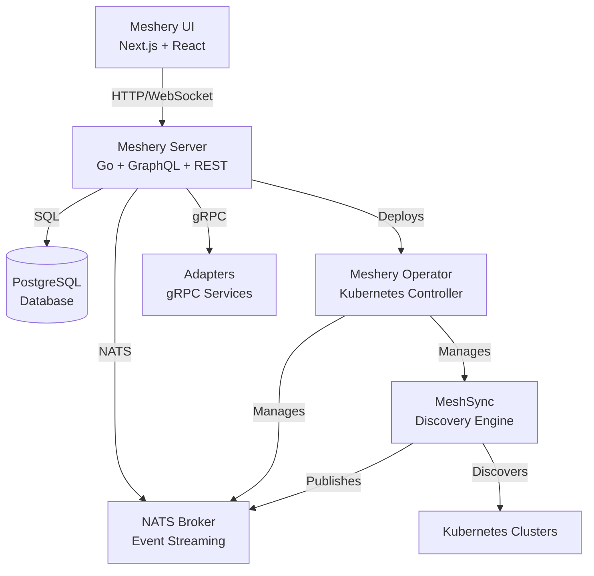

Meshery is a self-service engineering platform for cloud native infrastructure management. This page provides an overview of Meshery's architecture, its components, and how they work together to enable visual and collaborative GitOps for Kubernetes-based infrastructure.

## System Overview

Meshery's architecture consists of several key components that work together to provide comprehensive cloud native infrastructure management:

## Core Components

### Meshery Server

The Meshery Server is the central orchestration component written in Go. It exposes both REST and GraphQL APIs and handles all core business logic.

**Technology Stack:**
- Language: Go
- APIs: REST (Gorilla), GraphQL (gqlgen)
- Database: PostgreSQL with SQLite for local mode
- Messaging: NATS for event streaming

**Key Responsibilities:**
- User authentication and authorization via provider plugins
- Managing connections to Kubernetes clusters and other infrastructure
- Orchestrating design deployments and lifecycle management
- Storing and retrieving patterns, designs, and configurations
- Real-time event broadcasting to connected clients
- Adapter management and communication

**Network Ports:**
- `9081/tcp` - HTTP server for UI, REST, and GraphQL APIs
- `80/tcp` - WebSocket connections for real-time updates

<Note>
The Meshery Server treats its PostgreSQL database as a cache. While data is persisted to disk, the server can rebuild state from connected systems when needed.
</Note>

### Meshery UI

The web-based user interface provides visual design, collaboration, and management capabilities.

**Technology Stack:**
- Framework: Next.js with React
- State Management: Redux Toolkit
- GraphQL Client: Relay for subscriptions
- HTTP Client: Axios for REST endpoints
- UI Components: Material UI (MUI) and Sistent design system

**Features:**
- Visual designer (MeshMap) for infrastructure modeling
- Real-time collaboration on designs
- Connection and environment management
- Performance testing and metrics visualization
- Integration with remote providers for extended capabilities

### Meshery Database

Meshery uses PostgreSQL as its primary database for storing:

- User accounts and preferences
- Workspaces, environments, and connections
- Designs, patterns, and filters
- Performance test results and profiles
- Events and audit logs
- Mesh model registry (components, relationships, policies)

**Location:** By default, the database file is stored in `~/.meshery/config/`

### Meshery Operator

A multi-cluster Kubernetes operator that manages Meshery's in-cluster components.

**Responsibilities:**
- Deploying and managing MeshSync controllers
- Managing NATS Broker instances
- Monitoring health of Meshery components
- Handling operator lifecycle events

**Deployment:** The operator is deployed to each Kubernetes cluster that Meshery manages. It runs as a Deployment with appropriate RBAC permissions to manage custom resources.

### MeshSync

MeshSync is a Kubernetes controller that continuously discovers and synchronizes cluster state.

**Discovery Process:**
1. Watches Kubernetes resources across all namespaces
2. Identifies infrastructure patterns and installed components
3. Publishes discovered resources to NATS Broker
4. Maintains real-time synchronization of cluster state

**Multi-tier Discovery:**
- Kubernetes native resources (Pods, Services, Deployments, etc.)
- Custom Resource Definitions (CRDs)
- Service mesh components (Istio, Linkerd, Consul, etc.)
- Observability tools (Prometheus, Grafana, Jaeger)

<Info>
MeshSync enables Meshery to maintain an up-to-date view of your infrastructure without requiring constant polling. It publishes changes as they happen, allowing the UI to reflect real-time cluster state.
</Info>

### Meshery Broker

The NATS-based message broker provides event streaming and pub/sub messaging.

**Network Ports:**
- `4222/tcp` - Client connections from Meshery Server
- `8222/tcp` - HTTP management and monitoring endpoint

**Event Topics:**
- `meshsync.request` - Cluster state change events
- `meshery.broker` - General system events
- Connection lifecycle events
- Design deployment status updates

### Meshery Adapters

Adapters are gRPC services that provide integration with specific infrastructure platforms.

**Adapter Capabilities:**
- Service mesh lifecycle management (install, configure, validate)
- Infrastructure-specific operations (traffic management, policy enforcement)
- Sample application deployment
- Platform-specific metrics collection

**Communication:**
- Adapters register with Meshery Server via HTTP POST
- Server communicates with adapters over gRPC
- Each adapter exposes its capabilities in a registry

**Available Adapters:**
- Istio, Linkerd, Consul, Kuma, NGINX Service Mesh
- App Mesh, Traefik Mesh, Open Service Mesh
- Network Service Mesh, Cilium Service Mesh

<Tip>
Adapters are optional components. You only need to deploy adapters for the service meshes and platforms you're actively managing.
</Tip>

## Data Flow

Here's how data flows through the Meshery system:

1. **User Interaction:** User creates or modifies a design in the Meshery UI
2. **API Request:** UI sends GraphQL mutation or REST request to Meshery Server
3. **Business Logic:** Server processes the request, validates against policies, and updates database
4. **Deployment:** Server communicates with Kubernetes API or adapter gRPC endpoints
5. **Discovery:** MeshSync detects cluster state changes and publishes to NATS
6. **Event Propagation:** Server receives NATS events and updates database
7. **Real-time Update:** UI receives updates via GraphQL subscriptions and reflects changes

## Deployment Modes

Meshery can be deployed in several configurations:

### Docker Deployment

All components run as Docker containers on a single host:
- Meshery Server container
- UI served from Server container
- Optional adapter containers
- Local PostgreSQL container or file-based SQLite

### Kubernetes Deployment

Meshery Server runs in Kubernetes alongside managed clusters:
- Server deployed as Deployment + Service
- Operator deployed to each managed cluster
- MeshSync and Broker deployed by Operator
- Persistent storage for database

### Playground Mode

A sandboxed environment for experimentation:
- Pre-configured with sample designs
- Limited persistence
- Ideal for learning and testing

## Provider Architecture

Meshery supports extensibility through providers:

**Local Provider:**
- Built-in, no authentication required
- Stores data locally in SQLite
- Limited to single-user scenarios
- Good for development and testing

**Remote Providers:**
- External authentication services (e.g., Meshery Cloud)
- Multi-user collaboration features
- Team management and permissions
- Synchronization across instances
- Extended features like Catalog publishing

<Note>
Remote providers can be implemented by anyone following Meshery's extension points. This allows organizations to integrate Meshery with their existing identity and authorization systems.
</Note>

## Security Architecture

**Authentication:**
- JWT-based token authentication
- Provider-specific auth flows (OAuth, OIDC, etc.)
- Token-based API access for CLI and integrations

**Authorization:**
- Role-based access control via providers
- Workspace-level permissions
- Resource ownership model

**Communication Security:**
- TLS for external connections
- Service-to-service communication within Kubernetes
- Credential encryption at rest

## Statefulness

| Component | Persistence | Description |
|-----------|-------------|-------------|
| Meshery Server | Caches state | Application cache in `~/.meshery/`, treats DB as cache |
| Meshery UI | Stateless | Client-side state management only |
| Meshery Operator | Stateless | Kubernetes operator, manages CRDs |
| MeshSync | Stateless | Continuous discovery, publishes to NATS |
| Meshery Adapters | Stateless | Transactional interface with infrastructure |
| Meshery Providers | Stateful | Persistent user data, preferences, environments |
| mesheryctl | Stateless | CLI with configuration file |

## Scalability Considerations

**Horizontal Scaling:**
- Meshery Server can be scaled with load balancer
- Multiple MeshSync instances per large cluster
- NATS Broker supports clustering (planned)

**Performance:**
- GraphQL subscriptions for efficient real-time updates
- Database query optimization and indexing
- Caching layer for frequently accessed data
- Asynchronous processing for long-running operations

## Related Concepts

- [Workspaces](/concepts/workspaces) - Team collaboration and resource organization
- [Environments](/concepts/environments) - Managing deployment targets
- [Connections](/concepts/connections) - Integration with infrastructure
- [Models](/concepts/models) - Component and relationship definitions
- [Designs](/concepts/designs) - Infrastructure as code
