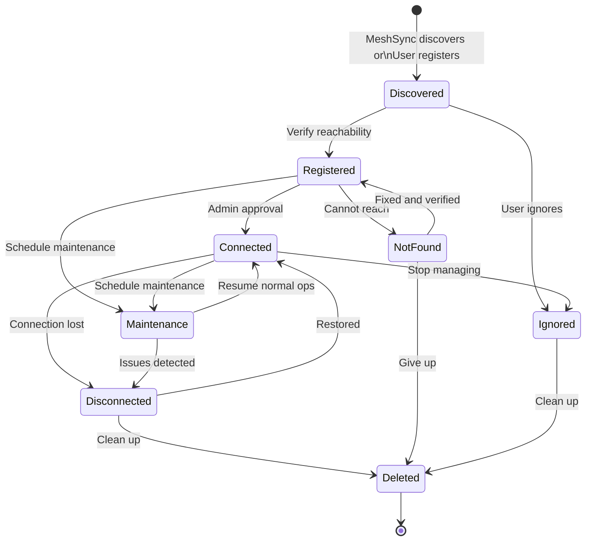

Meshery Connections represent integrations with infrastructure resources like Kubernetes clusters, Prometheus instances, Grafana dashboards, and service meshes. Connections can be discovered automatically by MeshSync or registered manually, and they're managed through a state machine that tracks their lifecycle and availability.

## What is a Connection?

A Connection is a resource that Meshery uses to interact with external infrastructure. Examples include:

- **Kubernetes clusters** - For deploying and managing workloads
- **Prometheus instances** - For metrics collection and monitoring  
- **Grafana servers** - For visualization and dashboards
- **Service mesh adapters** - For Istio, Linkerd, Consul, etc.
- **Container registries** - For image storage
- **Git repositories** - For version control integration

<Info>
Connections are managed resources that can be assigned to Environments, making them available across Workspaces for team collaboration.
</Info>

## Managed vs Unmanaged Connections

### Managed Connections

Managed connections are discovered and actively monitored by [MeshSync](/concepts/architecture#meshsync):

- **Automatic discovery:** MeshSync finds resources in connected clusters
- **Real-time sync:** Changes are detected and propagated immediately
- **Health monitoring:** Connection status is continuously tracked
- **Lifecycle management:** Meshery can deploy, configure, and remove resources

**Example:** Kubernetes cluster discovered via kubeconfig upload

### Unmanaged Connections

Unmanaged connections are manually registered by users:

- **Manual entry:** User provides connection details
- **Limited monitoring:** Basic reachability checks only
- **External management:** Resources managed outside Meshery
- **Integration only:** Used for querying or visualization

**Example:** Externally hosted Prometheus instance added by URL

<Note>
MeshSync can discover connections automatically, but they must be administratively approved (transitioned to Registered or Connected state) before Meshery can actively manage them.
</Note>

## Connection States

Meshery tracks connection status using a well-defined state machine. Understanding these states helps you manage connections effectively.

### State: Discovered

**Description:** Resource has been found but not yet validated for use.

- MeshSync discovers the resource through multi-tier cluster scanning
- Connection appears in the Connections table
- No reachability test has been performed
- Meshery has not attempted to manage the connection

**Example:** MeshSync discovers Prometheus components in a Kubernetes cluster

**Transitions:**
- → `Registered` - User or system verifies the connection
- → `Ignored` - User marks connection to be ignored

### State: Registered

**Description:** Connection has been verified as reachable and usable.

- Reachability test passed successfully
- Connection credentials validated (if required)
- Awaiting administrative decision on usage
- Ready to transition to active management

**Example:** User manually tests discovered Prometheus and confirms it's accessible

**Transitions:**
- → `Connected` - User chooses to actively manage the connection
- → `Maintenance` - Temporarily offline for updates
- → `Not Found` - Connection becomes unreachable

### State: Connected

**Description:** Connection is actively managed by Meshery.

- Full integration with Meshery features
- Can be used in designs and deployments
- Monitored for health and availability
- Actions can be invoked on the connection

**Example:** Meshery actively scraping metrics from Prometheus

**Transitions:**
- → `Disconnected` - Connection becomes unreachable (automatic)
- → `Maintenance` - User schedules maintenance window
- → `Ignored` - User stops managing the connection

<Info>
Certain connection types (like Meshery Server registration with remote providers) can automatically transition to Connected state.
</Info>

### State: Ignored

**Description:** Connection is administratively marked to be ignored.

- Meshery will not attempt to manage this connection
- Will not be rediscovered in future scans
- Previous data retained but not updated
- Persists across user sessions

**Example:** Development Prometheus instance that should not be monitored

**Differences from Disconnected:**
- **Ignored:** Intentional administrative decision
- **Disconnected:** Connectivity or authentication failure

### State: Maintenance

**Description:** Connection is temporarily offline for planned maintenance.

- Different from Disconnected or Ignored states
- Indicates scheduled downtime
- Prevents false alerts
- Can transition back to Connected when maintenance completes

**Example:** Kubernetes cluster undergoing version upgrade

**Transitions:**
- → `Connected` - Maintenance window completed
- → `Disconnected` - Issues encountered during maintenance

### State: Disconnected

**Description:** Previously connected resource is now unavailable.

- Was previously in Discovered, Registered, or Connected state
- Failed reachability or authentication checks
- May be due to network issues, revoked credentials, or deletion
- Historical data preserved

**Example:** Prometheus API token was revoked or service crashed

**Differences from Deleted:**
- **Disconnected:** Resource unreachable but may return
- **Deleted:** Resource administratively removed from Meshery

### State: Deleted

**Description:** Connection administratively removed from Meshery.

- All collected data will be deleted
- Connection removed from environments and workspaces
- Cannot be recovered (must be re-registered)

**Example:** Decommissioned Prometheus instance removed from Meshery

### State: Not Found

**Description:** Manually registered connection that cannot be reached.

- User attempted manual registration
- Meshery unable to establish connectivity
- May be due to incorrect URL, credentials, or network issues

**Example:** Typo in Prometheus URL during manual registration

**Differences from Disconnected:**
- **Not Found:** Never successfully connected
- **Disconnected:** Previously connected but now unreachable

## Connection Lifecycle



## Connection Types and Metadata

### Kubernetes Connections

```go
type ConnectionPayload struct {
    ID       uuid.UUID
    Kind     string // "kubernetes"
    Type     string // "platform"
    SubType  string // "management"
    Name     string
    Status   ConnectionStatus
    MetaData map[string]interface{}{
        "server_id":        "instance-uuid",
        "server": "https://kubernetes.example.com",
        "version":          "v1.28.0",
        "meshsync_deployment_mode": "cluster" // or "edge"
    }
}
```

**MeshSync Deployment Modes:**
- `cluster` - MeshSync deployed in each cluster (default)
- `edge` - Centralized MeshSync for edge/remote clusters

See server/handlers/connections_handlers.go:400-688 for MeshSync mode management.

### Prometheus Connections

```go
type PromConn struct {
    URL  string // "https://prometheus.example.com"
    Name string
}

type PromCred struct {
    Name              string
    APIKeyOrBasicAuth string // "username:password" or API key
}
```

See server/models/connections/connections.go:46-55.

### Grafana Connections

```go
type GrafanaConn struct {
    URL  string // "https://grafana.example.com"
    Name string
}

type GrafanaCred struct {
    Name              string
    APIKeyOrBasicAuth string // "username:password" or API key
}
```

See server/models/connections/connections.go:57-66.

### Meshery Server Connection

Meshery Server registers itself as a connection:

```go
func BuildMesheryConnectionPayload(serverURL string, credential map[string]interface{}) *ConnectionPayload {
    return &ConnectionPayload{
        Kind:    "meshery",
        Type:    "platform",
        SubType: "management",
        MetaData: map[string]interface{}{
            "server_id":        viper.GetString("INSTANCE_ID"),
            "server_version":   viper.GetString("BUILD"),
            "server_build_sha": viper.GetString("COMMITSHA"),
            "server_location":  serverURL,
        },
        Status:           CONNECTED,
        CredentialSecret: credential,
    }
}
```

See server/models/connections/connections.go:116-131.

## Working with Connections

### Querying Connections

**List all connections:**
```bash
GET /api/integrations/connections
```

**Query parameters:**
- `page` - Page number (default: 0)
- `pagesize` - Items per page (default: 10, max: 100)
- `search` - Search term for filtering
- `order` - Sort field (default: "updated_at desc")
- `status` - Filter by status: `["connected", "disconnected"]`
- `kind` - Filter by kind: `["kubernetes", "prometheus"]`
- `type` - Filter by type: `["platform", "observability"]`
- `name` - Partial name match

**Example:**
```bash
curl "https://meshery.example.com/api/integrations/connections?status=[\"connected\"]&kind=[\"kubernetes\"]&pagesize=25" \
  -H "Authorization: Bearer $TOKEN"
```

See server/handlers/connections_handlers.go:184-292.

### Creating Connections

**Register a new connection:**
```bash
POST /api/integrations/connections
```

**Request body:**
```json
{
  "kind": "prometheus",
  "type": "observability",
  "sub_type": "monitoring",
  "name": "production-prometheus",
  "metadata": {
    "url": "https://prometheus.example.com"
  },
  "credential_secret": {
    "api_key": "your-api-key-here"
  }
}
```

See server/handlers/connections_handlers.go:125-182.

### Updating Connections

**Update connection details:**
```bash
PUT /api/integrations/connections/{connectionId}
```

**Use cases:**
- Change MeshSync deployment mode
- Update connection name or metadata
- Modify connection status

**Example - Change MeshSync mode:**
```json
{
  "metadata": {
    "meshsync_deployment_mode": "edge"
  }
}
```

See server/handlers/connections_handlers.go:368-483 for mode change handling.

### Deleting Connections

**Remove a connection:**
```bash
DELETE /api/integrations/connections/{connectionId}
```

This permanently removes the connection from Meshery, including:
- Connection record in database
- Environment assignments
- Collected metrics and data

See server/handlers/connections_handlers.go:560-595.

## Connection State Management

Connections use a state machine implementation for lifecycle management:

```go
const (
    DISCOVERED   ConnectionStatus = "discovered"
    REGISTERED   ConnectionStatus = "registered"
    CONNECTED    ConnectionStatus = "connected"
    IGNORED      ConnectionStatus = "ignored"
    MAINTENANCE  ConnectionStatus = "maintenance"
    DISCONNECTED ConnectionStatus = "disconnected"
    DELETED      ConnectionStatus = "deleted"
    NOTFOUND     ConnectionStatus = "not found"
)
```

See server/models/connections/connections.go:22-31.

### Determining if Connection Should be Managed

```go
var validConnectionStatusToManage = []ConnectionStatus{
    DISCOVERED, REGISTERED, CONNECTED, NOTFOUND,
}

func ShouldConnectionBeManaged(c Connection) bool {
    for _, validStatus := range validConnectionStatusToManage {
        if validStatus == c.Status {
            return true
        }
    }
    return false
}
```

Connections in Maintenance or Ignored state are not managed, even during greedy Kubernetes connection import.

See server/models/connections/connections.go:71-87.

### State Notifications

When connection status changes, Meshery Server notifies the state machine:

```go
func (h *Handler) NotifySmOfConnectionStatusChange(
    context context.Context,
    userID uuid.UUID,
    provider models.Provider,
    token string,
    connection *connections.ConnectionPayload,
) (events.Event, error) {
    // Initialize state machine for connection
    // Send status transition event
    // Handle Kubernetes-specific logic (MeshSync, operators)
}
```

See server/handlers/connections_handlers.go:485-558.

## Connection Registration Process

For Kubernetes connections, registration follows a multi-step process:

1. **Init Event:** Client requests connection schema
   ```
   POST /api/integrations/connections/register
   {"status": "init", "kind": "kubernetes"}
   ```

2. **Server Response:** Returns connection and credential schemas
   ```json
   {
     "id": "process-tracker-uuid",
     "connection": {/* KubernetesConnection schema */},
     "credential": {/* KubernetesCredential schema */}
   }
   ```

3. **Client Submission:** Sends filled connection details
   ```
   POST /api/integrations/connections/register
   {"id": "process-tracker-uuid", "status": "register", ...}
   ```

4. **State Machine:** Connection enters state machine for validation

See server/handlers/connections_handlers.go:24-123.

## Best Practices

### Connection Naming

Use descriptive, consistent names:

```
✅ Good:
- "prod-gke-us-east"
- "staging-prometheus"
- "grafana-central"

❌ Avoid:
- "cluster1"
- "test"
- "my-k8s"
```

### Credential Management

1. **Rotate regularly:** Update credentials on a schedule
2. **Least privilege:** Use service accounts with minimal permissions
3. **Avoid sharing:** Don't reuse credentials across environments
4. **Secure storage:** Leverage Meshery's credential encryption

### Monitoring Connection Health

1. **Watch status:** Monitor connection state transitions
2. **Test regularly:** Verify connectivity periodically
3. **Alert on failures:** Set up notifications for disconnections
4. **Clean up:** Remove unused connections

### Environment Assignment

1. **Logical grouping:** Assign connections to appropriate environments
2. **Avoid duplication:** Reuse connections across environments when appropriate
3. **Clear purpose:** Document why connections are in each environment

<Tip>
Use connection tags and metadata to add context about purpose, owner, and usage patterns.
</Tip>

## Integration with Other Concepts

### Environments

Connections are assigned to [Environments](/concepts/environments):
- Group related connections together
- Make connections available in workspaces
- Share infrastructure access across teams

### Credentials

Connections use [Credentials](/concepts/credentials) for authentication:
- Separate credential storage for security
- Multiple connections can share credentials
- Credential updates propagate automatically

### Designs

Connections are deployment targets for [Designs](/concepts/designs):
- Designs specify which connections to deploy to
- Multiple connections can be targeted in one design
- Connection health affects deployment success

## Related Concepts

- [Environments](/concepts/environments) - Grouping connections for team access
- [Credentials](/concepts/credentials) - Secure authentication management  
- [MeshSync](/concepts/architecture#meshsync) - Automatic connection discovery
- [Workspaces](/concepts/workspaces) - Team collaboration and resource sharing
