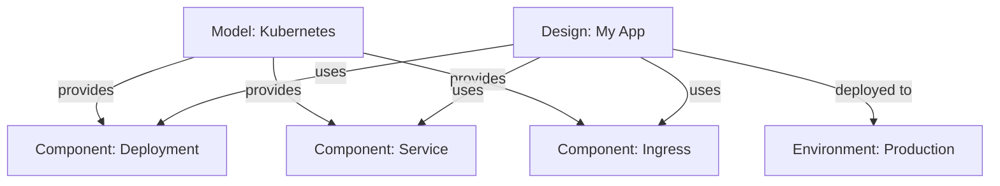

Meshery Designs are declarative, version-controlled definitions of your cloud native infrastructure. Like a Google Doc for infrastructure, Designs enable collaborative authorship, real-time editing, and comprehensive lifecycle management of your Kubernetes applications and services.

## What is a Design?

A Design is Meshery's deployable unit - a YAML-based description of all resources, configurations, and relationships needed for a deployment. Designs use Meshery's declarative syntax (defined in the [Meshery Schemas repository](https://github.com/meshery/schemas)) to describe infrastructure state.

**Key characteristics:**
- Declarative YAML format based on Meshery schemas
- Composed of [Components](/concepts/components) and [Relationships](/concepts/relationships)  
- Version-controlled with complete change history
- Stored in user accounts with optional sync to OCI registries or Git repos
- Shareable and collaboratively editable in real-time

<Info>
Designs are built from Components packaged in Models. While Models define what components exist and how they can relate, Designs declare specific instances and configurations for deployment.
</Info>

## Designs vs Models

Understanding the relationship between Designs and Models is crucial:

### Models

**What they are:**
- Packaging units for component definitions
- Define capabilities and constraints
- Blueprint templates for infrastructure
- Registered in Meshery's registry

**What they contain:**
- Component schemas and specifications
- Relationship definitions between components
- Policies governing behavior
- Metadata and versioning information

**Example:** The "Kubernetes" model contains component definitions for Pod, Service, Deployment, ConfigMap, etc.

### Designs  

**What they are:**
- Practical implementations using Model components
- Specific infrastructure declarations
- Deployable configurations
- Customized for specific use cases

**What they contain:**
- Instances of components from Models
- Configured relationships between instances
- Environment-specific parameters
- Deployment metadata

**Example:** An "E-commerce Application" design uses Kubernetes model components (Deployment, Service, Ingress) to declare a specific application stack.



<Note>
Models are NOT directly deployed. Designs reference components from Models and ARE deployed to Environments through Workspaces.
</Note>

## Design Structure

Designs are YAML documents following the Meshery pattern file format:

```yaml
name: my-application
version: 1.0.0
services:
  frontend:
    name: Frontend
    type: Deployment
    namespace: default
    model: kubernetes
    settings:
      spec:
        replicas: 3
        selector:
          matchLabels:
            app: frontend
        template:
          metadata:
            labels:
              app: frontend
          spec:
            containers:
            - name: web
              image: myapp/frontend:v1.0
              ports:
              - containerPort: 80
  
  frontend-service:
    name: Frontend Service
    type: Service  
    namespace: default
    model: kubernetes
    settings:
      spec:
        selector:
          app: frontend
        ports:
        - port: 80
          targetPort: 80
        type: LoadBalancer
    
    dependsOn:
    - frontend
```

### Design Components

Each component in a design represents an infrastructure resource:

**Component properties:**
- `name` - Display name for the component
- `type` / `kind` - Component type from Model (e.g., Deployment, Service)
- `model` - Source model name (e.g., kubernetes, istio)
- `namespace` - Kubernetes namespace for deployment
- `settings` - Component-specific configuration
- `traits` - Additional behaviors and policies
- `dependsOn` - Deployment order dependencies

### Design Metadata

Designs include metadata for management:

```yaml
id: 550e8400-e29b-41d4-a716-446655440000
name: E-commerce Platform  
version: 2.1.0
created_at: 2024-01-15T10:30:00Z
updated_at: 2024-03-01T14:22:00Z
user_id: user-uuid
visibility: public
tags:
- ecommerce
- microservices
- production
type: Deployment
```

## Design Lifecycle

### Creating Designs

Designs can be created in multiple ways:

**1. Visual Designer (MeshMap):**
- Drag-and-drop components onto canvas
- Configure relationships visually
- Real-time validation and preview
- Automatic YAML generation

**2. Import from Existing Resources:**
- Kubernetes manifests (YAML)
- Helm charts
- Docker Compose files
- Other Meshery designs

**3. Direct YAML Authoring:**
- Write design files manually
- Use templates as starting points
- Import from local filesystem or URLs

**4. Clone Existing Designs:**
- Copy and modify existing designs
- Maintain separate ownership
- Customize for different use cases

### Editing Designs

**Collaborative editing:**
- Multiple users can edit simultaneously
- Real-time synchronization of changes
- Conflict detection and resolution
- Change attribution and audit trail

**Version control:**
- Every save creates a new version
- Complete version history maintained
- Compare versions for differences
- Snapshot creation for immutable references

### Validating Designs

Before deployment, designs undergo validation:

**Syntax validation:**
- YAML structure correctness
- Schema compliance
- Required field presence

**Semantic validation:**
- Component relationships are valid
- Dependencies can be resolved
- Policies are satisfied
- Resources are available

**Dry-run deployment:**
```bash
POST /api/pattern/deploy?dryRun=true
```

Returns what would happen without actually deploying:
```json
{
  "Frontend": {
    "cluster-1": {
      "success": true,
      "component": { /* configuration */ }
    }
  },
  "Frontend Service": {
    "cluster-1": {
      "success": false,
      "error": {
        "status": "Failure",
        "causes": [
          {
            "message": "port 80 already allocated",
            "field": "settings.spec.ports[0].port",
            "type": "FieldValueInvalid"
          }
        ]
      }
    }
  }
}
```

See server/handlers/design_engine_handler.go:403-497 for dry-run implementation.

### Deploying Designs

**Deployment process:**

1. **Design Selection:** Choose design to deploy
2. **Environment Selection:** Select target environment(s)  
3. **Validation:** Run syntax and semantic checks
4. **Hydration:** Fill in missing component details from registry
5. **Provisioning:** Deploy components to target clusters
6. **Verification:** Confirm successful deployment

**Deployment API:**
```bash
POST /api/pattern/deploy
Content-Type: application/json

{
  "pattern_file": "<design-yaml>",
  "pattern_id": "550e8400-e29b-41d4-a716-446655440000"
}
```

**Query parameters:**
- `dryRun=true` - Validate without deploying
- `skipCRD=true` - Skip Custom Resource Definition installation
- `verify=true` - Run validation checks
- `upgrade=true` - Upgrade existing releases

See server/handlers/design_engine_handler.go:38-222.

### Deployment Pipeline

Designs flow through processing stages:

```go
chain := stages.CreateChain()
chain.
    Add(stages.Format()).              // Normalize format
    Add(stages.Filler()).              // Fill missing details  
    Add(stages.Validator()).           // Validate components
    Add(stages.DryRun()).              // Optional: test deployment
    Add(stages.Provision()).           // Deploy to clusters
    Process(&stages.Data{ /* ... */ })
```

See server/handlers/design_engine_handler.go:224-316.

### Undeploying Designs

Remove deployed resources:

```bash
DELETE /api/pattern/deploy
```

With the same payload as deployment. This removes:
- Deployed Kubernetes resources
- Associated configurations
- Related workloads

<Tip>
Use dry-run deployments to verify your design works correctly before deploying to production environments.
</Tip>

## Design Features

### Ownership and Sharing

**Ownership:**
- Design creator is the owner
- Owner controls access permissions
- Owner can delete the design

**Sharing:**
- Grant read or write access to other users
- Share within teams
- Make public for community access

**Constraints:**
- Design belongs to one workspace at a time
- Can be transferred between workspaces
- Cloning creates independent copy

### Import and Export

**Import formats:**
- Kubernetes YAML manifests
- Helm charts (converted to Meshery design)
- Docker Compose files
- Meshery design files (JSON/YAML)
- OCI images
- Remote URLs

**Export formats:**
- Meshery design JSON/YAML
- OCI-compatible images
- Embeddable HTML bundles
- React components (via [@meshery/meshery-design-embed](https://www.npmjs.com/package/@meshery/meshery-design-embed))

**Import via API:**
```bash
POST /api/pattern/import
```

### Snapshots

Snapshots are immutable point-in-time captures:

**Use cases:**
- Audit and compliance
- Rollback reference points
- Version comparison
- Design archival

**Features:**
- Immutable - cannot be modified
- Timestamped automatically  
- Compare with current or other snapshots
- Restore design to snapshot state

Learn more: [Kanvas Snapshot Extension](https://docs.meshery.io/extensions/kanvas-snapshot)

### Publishing to Catalog

Share designs with the community:

**Published designs:**
- Available to all Meshery users
- Listed in [Meshery Catalog](https://meshery.io/catalog)
- Discoverable in [Artifact Hub](https://artifacthub.io/packages/search?kind=24)
- Can be imported and customized

**Unpublished designs:**
- Private by default
- Optionally made public (viewable but not in Catalog)
- Shareable via direct links

### Versioning

Automatic version management:

**Version creation:**
- New version on every save
- Semantic versioning support
- Complete history maintained

**Version operations:**
- View version history
- Compare versions
- Restore to previous version (creates new version)
- Tag important versions

### Real-time Collaboration

**Multi-user editing:**
- See other users' cursors and selections
- Changes sync in real-time
- Conflict detection and resolution
- Activity feed shows who changed what

**Communication:**
- In-design comments
- Change notifications
- @mentions for collaboration

## Design Patterns and Templates

### Reusable Templates

Create design templates for common scenarios:

**Application templates:**
- Microservices base template
- Monolithic application template  
- Batch job template
- Static site template

**Infrastructure templates:**
- Service mesh configuration
- Observability stack
- Security baseline
- Networking foundation

**Coming in v0.9:** Convert designs to reusable Patterns with variables and parameterization.

### Design Composition

**Merging designs:**
Combine multiple designs into one:
```bash
POST /api/pattern/merge
{
  "designs": [
    "design-id-1",
    "design-id-2"  
  ]
}
```

Merged design includes:
- All components from both designs
- Combined relationships
- Merged metadata
- Conflict resolution required

## Best Practices

### Design Organization

1. **Single responsibility:** One design per logical application/service
2. **Modularity:** Break complex systems into composable designs
3. **Naming:** Use descriptive names that indicate purpose
4. **Documentation:** Add descriptions and comments
5. **Tagging:** Use consistent tags for categorization

### Version Management

1. **Semantic versioning:** Use major.minor.patch format
2. **Meaningful commits:** Describe what changed and why
3. **Regular snapshots:** Create snapshots before major changes
4. **Tag releases:** Mark production-deployed versions

### Collaboration

1. **Clear ownership:** Designate design owners
2. **Communication:** Use comments for discussions
3. **Review process:** Validate changes before deployment
4. **Access control:** Grant appropriate permissions

### Deployment

1. **Test first:** Use dry-run before actual deployment
2. **Progressive rollout:** Deploy to dev/staging before production
3. **Monitor health:** Watch deployment status and logs
4. **Rollback plan:** Know how to revert if needed

<Note>
Designs can be audited for security vulnerabilities, policy compliance, and adherence to organizational standards using Meshery's policy engine.
</Note>

## Design Technologies and Format

### Schema-based Validation

Designs are validated against JSON schemas:

**Component schemas:**
- Defined in component definitions
- Enforce required fields
- Type checking
- Constraint validation

**Pattern schemas:**  
- Overall design structure
- Service definitions
- Metadata requirements

### Pattern Format Versions

**v1alpha2 (Legacy):**
- Older format, still supported
- Automatically converted to v1beta1
- Deprecated for new designs

**v1beta1 (Current):**
- Current standard format
- Enhanced capabilities
- Better component support
- Improved relationship handling

See server/handlers/design_engine_handler.go:100-129 for automatic conversion.

### Design Processing

Internal processing chain:

1. **Format:** Normalize design format
2. **Hydrate:** Fill component details from registry
3. **Validate:** Check syntax and semantics  
4. **Provision:** Deploy to infrastructure

```go
type ProcessPatternOptions struct {
    Context                context.Context
    Provider               models.Provider
    Pattern                PatternFile
    UserID                 string
    IsDelete               bool
    Validate               bool
    DryRun                 bool
    SkipCRDAndOperator     bool
    UpgradeExistingRelease bool
}
```

See server/models/pattern/core/pattern.go.

## API Reference

Key design endpoints:

| Method | Endpoint | Description |
|--------|----------|-------------|
| GET | `/api/pattern` | List all designs |
| POST | `/api/pattern` | Create new design |
| GET | `/api/pattern/{id}` | Get design details |
| PUT | `/api/pattern/{id}` | Update design |
| DELETE | `/api/pattern/{id}` | Delete design |
| POST | `/api/pattern/deploy` | Deploy design |
| DELETE | `/api/pattern/deploy` | Undeploy design |
| POST | `/api/pattern/import` | Import design |
| POST | `/api/pattern/clone` | Clone design |

## Related Concepts

- [Models](/concepts/models) - Component and relationship definitions
- [Components](/concepts/components) - Building blocks for designs  
- [Relationships](/concepts/relationships) - Component interactions
- [Workspaces](/concepts/workspaces) - Collaboration and sharing
- [Environments](/concepts/environments) - Deployment targets
