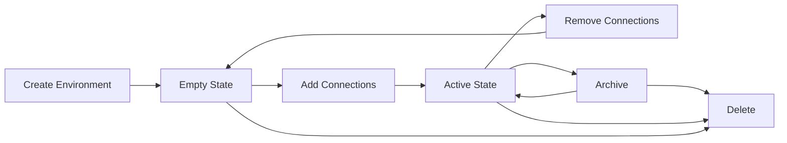

Meshery Environments provide a way to logically group related [Connections](/concepts/connections) and their associated credentials. Instead of managing individual connections to Kubernetes clusters, Prometheus instances, or other infrastructure, Environments let you work with collections of resources as cohesive groups.

## What is an Environment?

An Environment is a logical grouping of connections that represent a deployment target or infrastructure boundary. For example, you might create:

- A "production" environment with connections to your production Kubernetes clusters, monitoring systems, and databases
- A "dev/test" environment for development clusters and test infrastructure  
- A "monitoring" environment that groups all observability connections

<Info>
Environments can be assigned to one or more Workspaces, making it easy to share infrastructure access across teams while maintaining centralized credential management.
</Info>

## Key Features

### Logical Grouping

Environments allow you to organize connections based on:

- **Deployment stage** - Production, staging, development
- **Infrastructure type** - Kubernetes clusters, databases, monitoring tools
- **Geographic region** - US-East, EU-West, Asia-Pacific
- **Team ownership** - Platform team, application teams, SRE
- **Business domain** - E-commerce, analytics, payments

### Resource Sharing

When you assign an environment to a [Workspace](/concepts/workspaces):

- All connections become available to workspace members
- Team members can deploy designs to those connections
- Credentials are managed separately for security
- Same environment can be shared across multiple workspaces

### Flexible Assignment

- Add or remove connections dynamically
- Share environments across multiple workspaces
- Transfer connections between environments
- Maintain independent lifecycle from connections

## Data Model

Environments in Meshery use the schema defined in `github.com/meshery/schemas/models/v1beta1/environment`:

```go
type EnvironmentPayload struct {
    Name           string
    Description    string
    OrganizationID string
}

type EnvironmentPage struct {
    Page       int
    PageSize   int
    TotalCount int
    Environments []Environment
}
```

Environments are stored in the Meshery database and managed through the provider interface.

## Working with Environments

### Creating Environments

**Via REST API:**
```bash
curl -X POST https://meshery.example.com/api/environments \
  -H "Content-Type: application/json" \
  -H "Authorization: Bearer $TOKEN" \
  -d '{
    "name": "production",
    "description": "Production infrastructure",
    "organization_id": "org-uuid-here"
  }'
```

**Via Meshery UI:**
1. Navigate to Environments section
2. Click "Create Environment"
3. Enter name and description
4. Optionally add tags for organization
5. Click "Create"

### Managing Environment Resources

#### Adding Connections

Assign connections to an environment:

```bash
POST /api/environments/{environmentID}/connections/{connectionID}
```

Example: Add a Kubernetes cluster connection
```bash
curl -X POST https://meshery.example.com/api/environments/env-123/connections/conn-456 \
  -H "Authorization: Bearer $TOKEN"
```

<Note>
Adding a connection to an environment makes it available in all workspaces that include that environment.
</Note>

#### Removing Connections

```bash
DELETE /api/environments/{environmentID}/connections/{connectionID}
```

Removing a connection from an environment:
- Does NOT delete the connection itself
- Removes access from workspaces using this environment
- Preserves connection in other environments it belongs to

#### Querying Environment Connections

Get all connections in an environment:

```bash
GET /api/environments/{environmentID}/connections
```

**Query parameters:**
- `page` - Page number (default: 0)
- `pagesize` - Items per page (default: 20)
- `search` - Filter by connection name
- `order` - Sort field (e.g., "updated_at desc")
- `filter` - Advanced filtering options
  - `{"assigned": true}` - Only assigned connections
  - `{"deleted_at": false}` - Exclude soft-deleted

### Assigning to Workspaces

Make an environment available in a workspace:

```bash
POST /api/workspaces/{workspaceID}/environments/{environmentID}
```

This enables:
- Workspace members to view environment connections
- Deployment of designs to environment infrastructure
- Shared access without individual credential management

## Environment Lifecycle

### States and Transitions

Environments can exist in different states throughout their lifecycle:

**Active:**
- Environment is created and ready for use
- Connections can be added and removed
- Available for assignment to workspaces

**Empty:**
- Environment exists but has no connections assigned
- Valid state - can be populated later
- Useful for pre-provisioning environments

**Archived:**
- Environment is preserved but not actively used
- Maintains historical record
- Can be reactivated if needed

**Deleted:**
- Environment is removed from active use
- Contained connections persist and remain available
- Soft delete allows recovery

### Lifecycle Operations



### Deletion Behavior

<Note>
Deleting an environment does NOT delete any connections or credentials. Resources continue to exist independently and can be assigned to other environments.
</Note>

When you delete an environment:
- Environment-to-connection mappings are removed
- Connections remain available in other environments
- Workspace assignments are cleared
- Credentials associated with connections persist

## Connection Types in Environments

Environments can group various types of connections:

### Kubernetes Clusters

```bash
# Connection discovered by MeshSync
{
  "kind": "kubernetes",
  "type": "platform",
  "name": "prod-gke-us-east",
  "status": "connected",
  "metadata": {
    "server": "https://kubernetes.example.com",
    "version": "v1.28.0"
  }
}
```

### Prometheus Instances

```bash
# Manually registered Prometheus connection
{
  "kind": "prometheus",
  "type": "observability",
  "name": "prod-prometheus",
  "status": "registered",
  "metadata": {
    "url": "https://prometheus.example.com"
  }
}
```

### Grafana Servers

```bash
# Grafana connection for visualization
{
  "kind": "grafana",
  "type": "observability",
  "name": "prod-grafana",
  "status": "connected",
  "metadata": {
    "url": "https://grafana.example.com"
  }
}
```

### Service Mesh Adapters

Environments can also include connections to service mesh adapters like Istio, Linkerd, or Consul, though these are typically managed at the workspace level.

## Environment Patterns

### Pattern 1: Environment-per-Stage

Separate environments for each deployment stage:

```
Environment: "production"
├── Connections:
│   ├── prod-gke-us-east (Kubernetes)
│   ├── prod-gke-us-west (Kubernetes)
│   ├── prod-prometheus (Monitoring)
│   ├── prod-grafana (Visualization)
│   └── prod-rds (Database)

Environment: "staging"
├── Connections:
│   ├── staging-eks (Kubernetes)
│   ├── staging-prometheus (Monitoring)
│   └── staging-grafana (Visualization)

Environment: "development"
├── Connections:
    ├── dev-k3s-local (Kubernetes)
    └── dev-prometheus (Monitoring)
```

**Benefits:**
- Clear separation of deployment targets
- Different security policies per environment
- Reduced risk of production accidents

### Pattern 2: Shared Infrastructure

Common resources shared across teams:

```
Environment: "shared-monitoring"
├── Connections:
│   ├── central-prometheus (Monitoring)
│   ├── central-grafana (Visualization)
│   └── central-jaeger (Tracing)
└── Assigned to Workspaces:
    ├── platform-team
    ├── app-team-alpha
    └── app-team-beta
```

**Benefits:**
- Centralized observability
- Consistent monitoring across teams
- Reduced duplication of resources

### Pattern 3: Region-based Environments

Organize by geographic region:

```
Environment: "us-east"
├── Connections:
│   ├── gke-us-east-1 (Kubernetes)
│   ├── gke-us-east-2 (Kubernetes)
│   └── prometheus-us-east (Monitoring)

Environment: "eu-west"
├── Connections:
    ├── eks-eu-west-1 (Kubernetes)
    ├── eks-eu-west-2 (Kubernetes)
    └── prometheus-eu-west (Monitoring)
```

**Benefits:**
- Geographic isolation
- Compliance with data residency requirements
- Optimized latency for regional deployments

## Resource Sharing Between Environments

Environments support flexible resource sharing:

**Example:** Shared GitHub connection

```
Environment: "production"
├── Connections:
│   ├── github-main (shared)
│   ├── prod-k8s
│   └── prod-prometheus

Environment: "development"  
├── Connections:
    ├── github-main (shared)
    ├── dev-k8s
    └── dev-prometheus
```

The same connection can be assigned to multiple environments, enabling:
- Shared source control access
- Common credential management
- Reduced duplication
- Centralized updates

<Tip>
Use shared connections for resources that span multiple environments, like version control systems, container registries, or centralized monitoring.
</Tip>

## Security and Access Control

### Credential Management

Environments work with [Credentials](/concepts/credentials) to securely authenticate connections:

- Credentials are stored separately from environment definitions
- Multiple connections can share the same credential
- Credential updates automatically apply to all connections
- Encryption at rest for sensitive data

### Access Control Through Workspaces

Access to environment resources is controlled at the workspace level:

1. **Workspace membership** determines who can access environments
2. **Environment assignment** controls which connections are available
3. **Connection permissions** define what operations are allowed
4. **Audit logging** tracks all environment and connection changes

### Best Practices for Security

1. **Separation of duties:** Use different environments for different privilege levels
2. **Least privilege:** Only add connections that are needed
3. **Regular audits:** Review environment contents quarterly
4. **Credential rotation:** Update credentials regularly
5. **Production isolation:** Keep production environments separate

## API Reference

Key environment API endpoints:

| Method | Endpoint | Description |
|--------|----------|-------------|
| GET | `/api/environments` | List all environments |
| POST | `/api/environments` | Create new environment |
| GET | `/api/environments/{id}` | Get environment details |
| PUT | `/api/environments/{id}` | Update environment |
| DELETE | `/api/environments/{id}` | Delete environment |
| GET | `/api/environments/{id}/connections` | List connections |
| POST | `/api/environments/{id}/connections/{connID}` | Add connection |
| DELETE | `/api/environments/{id}/connections/{connID}` | Remove connection |

All endpoints require authentication via Bearer token.

### Query Parameters

Common query parameters across environment endpoints:

- `orgID` - Organization ID (required for multi-tenant setups)
- `page` - Page number for pagination
- `pagesize` - Number of items per page
- `search` - Search by environment name
- `order` - Sort order (e.g., "name", "created_at desc")
- `filter` - JSON filter conditions

## Best Practices

### Naming Conventions

Use clear, consistent naming:

```
✅ Good:
- "prod", "staging", "dev"
- "us-east-production"
- "monitoring-shared"
- "team-alpha-dev"

❌ Avoid:
- "environment1"
- "test123"
- "my-env"
```

### Organization Strategies

1. **Document purpose:** Add clear descriptions to each environment
2. **Consistent tagging:** Use tags for categorization and filtering
3. **Regular cleanup:** Remove unused environments and connections
4. **Change management:** Track why connections are added/removed
5. **Separation of concerns:** Don't mix unrelated infrastructure

### Monitoring and Maintenance

1. **Health checks:** Monitor connection status in environments
2. **Audit logs:** Review environment changes regularly
3. **Usage tracking:** Identify unused environments
4. **Connection testing:** Verify connectivity periodically
5. **Capacity planning:** Plan for environment growth

## Related Concepts

- [Workspaces](/concepts/workspaces) - Team collaboration and access control
- [Connections](/concepts/connections) - Infrastructure integration and discovery
- [Credentials](/concepts/credentials) - Secure credential management
- [Designs](/concepts/designs) - Deployable infrastructure configurations
