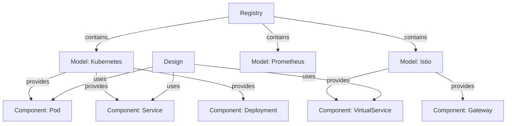

Meshery Models are versioned packages that define infrastructure building blocks. They provide a consistent, extensible framework for characterizing cloud native resources - from simple applications to complex microservices architectures and their underlying infrastructure.

## What is a Model?

A Model serves as a packaging unit that bundles related infrastructure definitions together. Each model is versioned and can contain:

- **Components** - Infrastructure resource definitions (Pods, Services, Istio VirtualServices, etc.)
- **Relationships** - How components interact and depend on each other
- **Policies** - Rules governing component behavior and constraints
- **Connections** - Integration definitions for external systems
- **Credentials** - Authentication schemas for accessing resources

<Info>
Models are the foundation of Meshery's extensibility. Without models and their registrants, Meshery cannot manage any infrastructure.
</Info>

## Key Characteristics

### Versioned and Portable

Models are:
- **Versioned:** Each model has semantic versioning (e.g., kubernetes v1.28.0)
- **Portable:** Can be exported as OCI-compatible images
- **Shareable:** Published to registries for reuse
- **Immutable:** Specific versions don't change

### Comprehensive Coverage

Models represent diverse infrastructure:
- **Kubernetes native resources** - Pods, Deployments, Services, ConfigMaps
- **Service meshes** - Istio, Linkerd, Consul, Kuma
- **Cloud providers** - AWS, Azure, GCP resources
- **Observability tools** - Prometheus, Grafana, Jaeger
- **Databases** - PostgreSQL, MySQL, MongoDB operators
- **Custom applications** - Your own infrastructure definitions

### Extensible Architecture

Models support:
- Defining custom components
- Creating new relationships
- Adding custom policies
- Extending existing models
- Building model hierarchies

## Models in the Architecture

Models are stored in Meshery's [Registry](/concepts/registry):



**Registry responsibilities:**
- Store and index models
- Manage model versions
- Enable model discovery
- Track model relationships
- Provide model APIs

See server/models/meshmodel/ for model implementation.

## Model Structure

Models are defined with metadata and packaged contents:

```yaml
name: kubernetes
version: v1.28.0
model:
  displayName: Kubernetes
  category:
    name: Orchestration & Management
  metadata:
    source: https://github.com/kubernetes/kubernetes
    primaryColor: "#326CE5"
    secondaryColor: "#7aa1f0"
    svgColor: "<svg>...</svg>"
    svgWhite: "<svg>...</svg>"
components:
  - name: Pod
    version: v1
    schema: "<json-schema>"
  - name: Service  
    version: v1
    schema: "<json-schema>"
  - name: Deployment
    version: v1
    schema: "<json-schema>"
relationships:
  - kind: hierarchical
    type: parent
    selectors:
      - from:
          kind: Deployment
        to:
          kind: Pod
```

### Model Metadata

Key metadata fields:

**Identity:**
- `name` - Unique model identifier
- `version` - Semantic version
- `displayName` - Human-readable name

**Classification:**
- `category` - Model categorization (e.g., "Orchestration & Management")
- `subCategory` - Finer-grained classification

**Visual:**
- `primaryColor` - Brand color for UI
- `secondaryColor` - Accent color
- `svgColor` - Colored icon
- `svgWhite` - White icon for dark backgrounds

**Source:**
- `source` - Origin URL (GitHub, docs, etc.)
- `metadata` - Additional context

### Component Definitions

Components within a model define infrastructure capabilities:

```yaml
component:
  kind: VirtualService
  version: v1beta1
  schema:
    properties:
      spec:
        properties:
          hosts:
            type: array
            items:
              type: string
          http:
            type: array
            items:
              type: object
              properties:
                route:
                  type: array
```

See [Components](/concepts/components) for detailed information.

### Relationship Definitions

Relationships describe component interactions:

**Relationship types:**
- **Hierarchical** - Parent-child relationships (Deployment → Pod)
- **Edge** - Network connections (Service → Pod)
- **Sibling** - Peer relationships (Pod ↔ Pod)
- **Binding** - Configuration bindings (ConfigMap → Deployment)

```yaml
relationship:
  kind: hierarchical
  type: parent
  subType: inventory
  selectors:
    - from:
        kind: Deployment
        model: kubernetes
      to:
        kind: ReplicaSet  
        model: kubernetes
```

See [Relationships](/concepts/relationships) for detailed information.

## Model Registration

Models are registered in Meshery through registrants:

### What is a Registrant?

A registrant is a component that registers models with Meshery Server:

**Registrant types:**
- **Meshery Server** - Built-in models
- **Meshery Adapters** - Service mesh models (Istio, Linkerd, etc.)
- **MeshSync** - Discovered CRDs and operators
- **Manual imports** - User-uploaded models
- **OCI registries** - Pulled model images

**Registration process:**

1. Registrant starts and connects to Meshery Server
2. Registrant provides model definitions
3. Server validates model schema
4. Components registered in capability registry
5. Relationships indexed for evaluation
6. Models become available for use

### Model Discovery

MeshSync automatically discovers models:

```go
// MeshSync discovers CRDs in cluster
// Identifies operator-managed resources
// Registers as models in Meshery
```

**Discovered models include:**
- Custom Resource Definitions (CRDs)
- Operator-managed resources
- Service mesh components
- Observability integrations

See server/models/k8s_components_registration.go.

## Model Lifecycle

### Importing Models

**Via Meshery UI:**
1. Navigate to Registry → Models
2. Click "Import Model"
3. Upload model file or provide URL
4. Review and confirm import

**Via API:**
```bash
POST /api/meshmodels/import
Content-Type: multipart/form-data

file: @model.yaml
```

**Via OCI Registry:**
```bash
# Pull from registry
mesheryctl model import oci://registry.example.com/models/mymodel:v1.0.0
```

### Exporting Models

**As OCI Image:**
```bash
mesheryctl model export mymodel:v1.0.0 \
  --output oci \
  --registry registry.example.com/models
```

**As YAML:**
```bash
mesheryctl model export mymodel:v1.0.0 \
  --output yaml \
  --file mymodel.yaml
```

### Versioning Models

Models follow semantic versioning:

```
MAJOR.MINOR.PATCH

v1.2.3
 │ │ │
 │ │ └── Patch: Bug fixes, no breaking changes
 │ └──── Minor: New features, backward compatible
 └────── Major: Breaking changes
```

**Version rules:**
- Same name + version = duplicate (rejected)
- Different versions can coexist
- Designs specify which version to use
- Default to latest version if not specified

See server/models/meshmodel/ for versioning implementation.

## Built-in Models

Meshery includes models for popular infrastructure:

### Kubernetes Core

**Model:** `kubernetes`  
**Components:** Pod, Service, Deployment, StatefulSet, DaemonSet, Job, CronJob, ConfigMap, Secret, Ingress, NetworkPolicy, PersistentVolume, PersistentVolumeClaim, ServiceAccount, Role, RoleBinding, and more.

### Service Meshes

**Istio Model:**
- VirtualService, DestinationRule, Gateway, ServiceEntry
- EnvoyFilter, Sidecar, WorkloadEntry, WorkloadGroup
- AuthorizationPolicy, PeerAuthentication, RequestAuthentication

**Linkerd Model:**
- ServiceProfile, TrafficSplit
- HTTPRoute, TCPRoute

**Consul Model:**
- ServiceDefaults, ServiceResolver, ServiceRouter, ServiceSplitter
- ProxyDefaults, IngressGateway, TerminatingGateway

### Observability

**Prometheus Model:**
- ServiceMonitor, PodMonitor, PrometheusRule
- Prometheus, Alertmanager, ThanosRuler

**Grafana Model:**
- Dashboard, Datasource, Folder
- GrafanaNotificationPolicy, GrafanaNotificationChannel

### Cloud Providers

**AWS Models:**
- EC2, EKS, RDS, S3, Lambda, DynamoDB
- VPC, IAM, CloudFront, Route53

See server/meshmodel/ for the complete list of 300+ models.

## Creating Custom Models

### Model Definition Template

```yaml
name: my-custom-model
version: v1.0.0
model:
  displayName: My Custom Infrastructure
  category:
    name: Custom
  metadata:
    source: https://github.com/myorg/my-infrastructure
    primaryColor: "#FF6B6B"
    secondaryColor: "#FFE66D"
    svgColor: |
      <svg><!-- your icon --></svg>
components:
  - name: CustomResource
    version: v1
    schema:
      type: object
      properties:
        spec:
          type: object
          properties:
            # your spec fields
relationships:
  - kind: hierarchical
    type: parent
    selectors:
      - from:
          kind: Parent
        to:
          kind: Child
```

### Component Schema

Define component schemas using JSON Schema:

```yaml
component:
  kind: MyCustomResource
  version: v1alpha1
  schema:
    type: object
    required:
      - apiVersion
      - kind
      - metadata
      - spec
    properties:
      apiVersion:
        type: string
      kind:
        type: string
      metadata:
        type: object
      spec:
        type: object
        required:
          - replicas
        properties:
          replicas:
            type: integer
            minimum: 1
            maximum: 100
          image:
            type: string
```

### Relationship Definition

Define how components relate:

```yaml
relationship:
  kind: edge
  type: network
  subType: connection
  selectors:
    - from:
        kind: Service
        model: kubernetes
      to:
        kind: Pod
        model: kubernetes
        match:
          labels:
            # Pod must match Service selector
  metadata:
    description: Service routes traffic to Pods
```

<Tip>
Use the Meshery playground or UI to visually test your custom models before publishing them.
</Tip>

## Model Portability

### OCI Image Format

Models export as OCI-compatible images:

**Image structure:**
```
registry.example.com/models/kubernetes:v1.28.0
├── config.json
├── manifest.json
└── layers/
    ├── components.tar.gz
    ├── relationships.tar.gz
    └── metadata.json
```

**Benefits:**
- Standard container registry storage
- Version control through tags
- Access control via registry permissions
- Bandwidth-efficient layer caching

### Intellectual Property Protection

Model packaging protects custom work:

**Encapsulation:**
- Package proprietary components
- Hide implementation details
- Control distribution
- Enforce licensing

**Sharing options:**
- Private registries for internal use
- Public registries for community sharing
- Selective component exposure
- Watermarking and attribution

## Model Registry

The registry is Meshery's model database:

**Registry capabilities:**
- Store all registered models
- Index components for fast lookup
- Track relationship definitions
- Manage model versions
- Provide search and discovery
- Enable model querying

**Registry APIs:**
```bash
# List all models
GET /api/meshmodels/models

# Get specific model
GET /api/meshmodels/models/{name}/{version}

# List components in model
GET /api/meshmodels/models/{name}/components

# Search components
GET /api/meshmodels/components?search=pod
```

See [Registry](/concepts/registry) for complete details.

## Design Principles

Meshery Models adhere to key design principles:

### 1. Comprehensive

Represent wide range of cloud native resources:
- Core infrastructure (Kubernetes, VMs)
- Service meshes and networking
- Observability and monitoring
- Security and policy
- Databases and storage
- Custom applications

### 2. Extensible

Support customization and extension:
- Add new components to existing models
- Define custom relationships
- Create entirely new models
- Override default behaviors

### 3. User-Centric

Designed for ease of use:
- Intuitive component naming
- Clear relationship semantics
- Visual representations
- Documentation and examples

### 4. Machine-Readable

Enable automation:
- Structured schemas (JSON, YAML)
- Programmatic access via APIs
- Integration with CI/CD
- Infrastructure as Code support

## Best Practices

### Model Design

1. **Single responsibility:** One model per logical infrastructure domain
2. **Semantic naming:** Use clear, descriptive names
3. **Version compatibility:** Follow semantic versioning strictly
4. **Documentation:** Include descriptions and examples
5. **Testing:** Validate models before publishing

### Component Definitions

1. **Complete schemas:** Define all component properties
2. **Validation rules:** Use JSON Schema constraints
3. **Defaults:** Provide sensible default values
4. **Examples:** Include usage examples
5. **Metadata:** Add display names, descriptions, icons

### Relationship Mapping

1. **Explicit relationships:** Define all component interactions
2. **Correct semantics:** Use appropriate relationship types
3. **Bidirectional:** Consider both directions of relationships
4. **Policy enforcement:** Use policies to validate relationships

### Model Distribution

1. **Versioning:** Bump versions appropriately
2. **Changelog:** Document changes between versions
3. **Deprecation:** Mark deprecated components clearly
4. **Migration guides:** Help users upgrade

<Note>
Models having the same name and version are considered duplicates and will be rejected during registration.
</Note>

## Related Concepts

- [Components](/concepts/components) - Building blocks within models
- [Relationships](/concepts/relationships) - Component interaction definitions
- [Designs](/concepts/designs) - Using model components in deployments
- [Registry](/concepts/registry) - Model storage and discovery
- [Policies](/concepts/policies) - Governance and constraints
